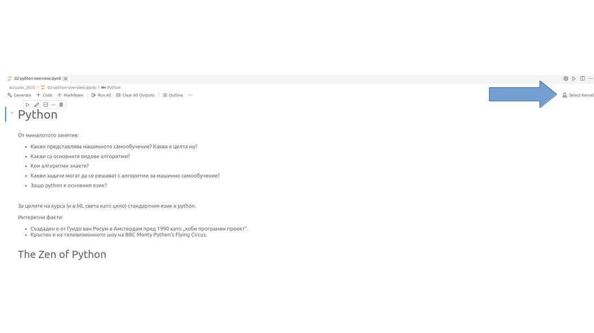

## A Guide to Python Virtual Environments

## What are Virtual Environments and Why Use Them?

In Python development, a virtual environment is a **self-contained directory** that holds a specific Python interpreter and its own set of installed packages. Think of it as an isolated workspace for each of your projects. 

The primary reasons for using them are:

  * **Dependency Management:** Different projects may require different versions of the same library. Virtual environments **prevent conflicts** by keeping each project's dependencies separate. For example, Project A might need `pandas` version 1.5, while Project B needs version 2.1.
  * **Reproducibility:** By creating a list of a project's dependencies (`requirements.txt`), you can easily recreate the exact environment on another machine, ensuring the code runs consistently everywhere.
  * **Clean Global Python Installation:** It keeps your system's global Python installation clean and free from project-specific packages.

## This guide will walk you through creating a virtual environment for a project using **Python 3.14**.

## For macOS & Linux (using `venv`)

The **`venv`** module is the standard way to create virtual environments and comes built-in with Python 3.3 and later.

### 0\. Install Python 3.14 (if not already installed)

Before creating a virtual environment, you need to have the desired Python version installed on your system.

**On macOS (using Homebrew):**
If you don't have Homebrew, install it first. Then, you can install Python 3.14 by running:

```bash
brew install python@3.14
```

**On Ubuntu/Debian-based Linux:**

```bash
sudo apt update
sudo apt install software-properties-common
sudo add-apt-repository ppa:deadsnakes/ppa
sudo apt install python3.14
```

### 1\. Create the Virtual Environment

First, navigate to your project's directory in the terminal. Then, run the following command to create a virtual environment. We'll name it `venv` in this example, which is a common convention.

```bash
python3.14 -m venv venv
```

This command creates a new folder named **`venv`** inside your project directory. This folder contains a copy of the Python interpreter and a place to install libraries.

### 2\. Activate the Environment

To start using the environment, you need to **"activate"** it. This adjusts your terminal's path to point to the Python and `pip` executables within the `venv` folder.

```bash
source venv/bin/activate
```

Once activated, you'll see the name of the environment in parentheses at the beginning of your terminal prompt, like `(venv)`. Any Python packages you install now will be placed in this local environment, not in your global Python installation.

### 3\. Deactivating the Environment

When you're finished working, you can simply run:

```bash
deactivate
```

-----

## For Windows (using Anaconda)

**Anaconda** is a popular distribution for Python that includes its own environment and package manager called **`conda`**. It's especially common in data science. You can download it from here.

### 1\. Create the Virtual Environment

Open the **Anaconda Prompt** (not the regular Command Prompt). To create a new environment with Python 3.14, run the following command. We will name this environment `my-project-env`.

```bash
conda create --name my-project-env python=3.14
```

`conda` will show you a list of packages that will be installed and ask you to confirm by typing `y`.

### 2\. Activate the Environment

To activate your new environment, use the `conda activate` command:

```bash
conda activate my-project-env
```

Your prompt will change to show the active environment's name, for example, `(my-project-env)`.

### 3\. Deactivating the Environment

To exit the environment, you can run:

```bash
conda deactivate
```

-----

## Using Your Environment in a VS Code Jupyter Notebook 💻

Once your virtual environment is created and activated, you can easily use it as the **kernel** for a Jupyter Notebook within Visual Studio Code (VS Code).

1.  **Install Recommended Extensions:** For the best experience, ensure you have the official **Python** and **Jupyter** extensions from Microsoft installed. You can find them in the Extensions view (View \> Extensions).

      * `ms-python.python` - Python
      * `ms-toolsai.jupyter` - Jupyter

2.  Open your project folder in VS Code (where your `venv` folder is).

3.  Create or open a Jupyter Notebook file (`.ipynb`).

4.  **Select the Kernel:** In the top-right corner of the notebook, click on the button that shows the current Python kernel (it might say "Select Kernel").



5.  **Choose Your Environment:** A dropdown list of available Python interpreters will appear. Find and select the Python interpreter located inside your newly created virtual environment.

      * **For `venv` users:** This will typically be found within the `venv/bin/` directory of your project.
      * **For `conda` users:** VS Code will usually auto-detect your `conda` environments and list `my-project-env` as an option.

6.  **Ready to Go:** Once selected, the notebook will be connected to your virtual environment. Any cells you run will use the Python interpreter and packages from that isolated environment, ensuring your project's dependencies are managed correctly.